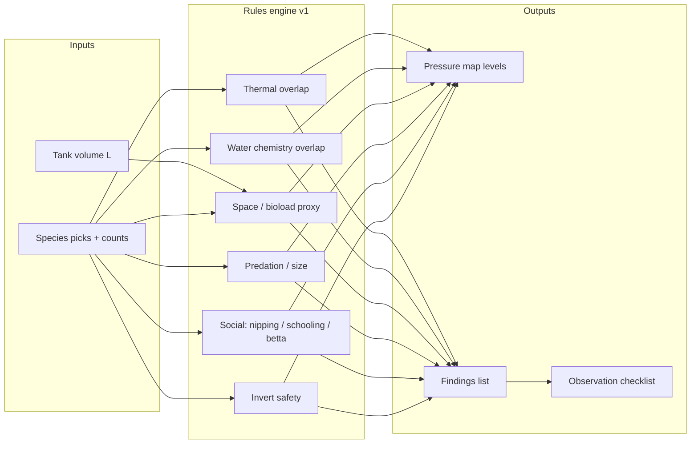

# Community Stress Lab — MVP specification

**Internal product name (working):** Community Stress Lab  
**Public-facing options:** “Community Stress Lab”, “Tank mates — pressure map”, “Virtual ecology bench”  
**Document version:** 1.1  
**Last updated:** 2026-05-19  

> **Nota ringkas (BM):** Spesifikasi pelaksanaan MVP untuk lab “tank mates” berasaskan **tekanan ekologi**, bukan ramalan tingkah laku atau peratusan keserasian. Rujuk `data/community-stress-lab-species-v1.json` untuk data pack; `data/community-stress-lab-species.schema.json` untuk validasi.

---

## 1. Product charter

### 1.1 Promise (one sentence)

Help keepers see **where ecological pressures overlap** when combining species, so they plan stocking with **open eyes** — never replacing real-tank observation.

### 1.2 Non-goals

- No “compatibility percentage” or green/red single verdict.
- No claim to simulate **individual** fish behaviour or aggression outcomes.
- No medical or disease diagnosis.
- No exhaustive global species database in MVP.

### 1.3 Relationship to existing site

| Surface | Role |
|--------|------|
| **Keeper’s Log** | Personal phase, parameters, care rhythm — ground truth for *your* tanks. |
| **Reading** (e.g. `/articles/community-fish-tank`) | Concepts and narrative. |
| **This lab** | Generic, interactive **pressure pedagogy** for hypothetical mixes. |

---

## 2. MVP screen — wireframe

### 2.1 Single-page layout (mobile-first, one primary screen)

```
┌─────────────────────────────────────────────┐
│ [← Aquatic Rhythm]   Community Stress Lab  │
├─────────────────────────────────────────────┤
│ Short intro (2–3 lines) + link “Read ARA”   │
│ Disclaimer strip (always visible, compact)  │
├─────────────────────────────────────────────┤
│ TANK CONTEXT                                 │
│  Volume (L) [slider 20–240]                 │
│  Plant cover [low / med / high] — v1.1 opt  │
├─────────────────────────────────────────────┤
│ SPECIES PICKER                               │
│  [Search________]  [+ Add species ▼]        │
│  Chips: [Neon tetra ×6] [x] [Betta ×1] [x]  │
│  Limits MVP: max 6 distinct species;         │
│  max 24 total fish-equivalent count          │
├─────────────────────────────────────────────┤
│ PRESSURE MAP                                 │
│  Lanes: Thermal · Chemistry · Space          │
│         · Predation · Social · Inverts       │
│  Level per lane: low | elevated | high       │
│  Tap lane → detail                           │
├─────────────────────────────────────────────┤
│ FINDINGS (sorted by severity)                │
├─────────────────────────────────────────────┤
│ OBSERVATION CHECKLIST (ARA-aligned)          │
├─────────────────────────────────────────────┤
│ LINKS: community article, adding fish,       │
│        Tank Builder, Keeper’s Log            │
└─────────────────────────────────────────────┘
```

### 2.2 Mermaid — data flow



---

## 3. Species pack v1 (32 entries)

**Pack ID:** `community-stress-species-v1`  
**Machine file:** [`data/community-stress-lab-species-v1.json`](../data/community-stress-lab-species-v1.json)

| `id` | Display name | Scientific name (reference) |
|------|----------------|-------------------------------|
| `neon_tetra` | Neon tetra | *Paracheirodon innesi* |
| `cardinal_tetra` | Cardinal tetra | *Paracheirodon axelrodi* |
| `rummynose_tetra` | Rummy-nose tetra | *Hemigrammus bleheri* |
| `ember_tetra` | Ember tetra | *Hyphessobrycon amandae* |
| `harlequin_rasbora` | Harlequin rasbora | *Trigonostigma heteromorpha* |
| `chili_rasbora` | Chili rasbora | *Boraras brigittae* |
| `celestial_pearl_danio` | Celestial pearl danio | *Danio margaritatus* |
| `zebra_danio` | Zebra danio | *Danio rerio* |
| `cherry_barb` | Cherry barb | *Puntius titteya* |
| `tiger_barb` | Tiger barb | *Puntigrus tetrazona* |
| `corydoras_bronze` | Bronze corydoras | *Corydoras aeneus* |
| `corydoras_panda` | Panda corydoras | *Corydoras panda* |
| `otocinclus` | Otocinclus | *Macrotocinclus affinis* (trade) |
| `kuhli_loach` | Kuhli loach | *Pangio semicincta* complex |
| `bolivian_ram` | Bolivian ram | *Mikrogeophagus altispinosus* |
| `german_blue_ram` | German blue ram | *Mikrogeophagus ramirezi* |
| `pearl_gourami` | Pearl gourami | *Trichopodus leerii* |
| `honey_gourami` | Honey gourami | *Trichogaster chuna* |
| `dwarf_gourami` | Dwarf gourami | *Trichogaster lalius* |
| `betta_male` | Betta (male) | *Betta splendens* |
| `betta_female` | Betta (female) | *Betta splendens* |
| `angelfish` | Angelfish | *Pterophyllum* scalare complex |
| `discus` | Discus | *Symphysodon* spp. |
| `guppy` | Guppy | *Poecilia reticulata* |
| `endler` | Endler’s livebearer | *Poecilia wingei* |
| `molly` | Molly | *Poecilia sphenops* complex |
| `amano_shrimp` | Amano shrimp | *Caridina multidentata* |
| `cherry_shrimp` | Cherry shrimp | *Neocaridina davidi* |
| `nerite_snail` | Nerite snail | *Neritina* / *Vittina* spp. |
| `mystery_snail` | Mystery snail | *Pomacea* complex |
| `mbuna_generic` | Mbuna (generic stand-in) | Malawi rock-dwelling cichlids |
| `goldfish` | Common goldfish | *Carassius auratus* |

**Citation workflow (editorial):** each species record in JSON carries `citationNote` (short text) and optional `sources[]` URLs added over time (FishBase, serious regional guides). MVP ships with `citationNote: "Hobby consensus ranges — verify before stocking"` unless replaced.

---

## 4. Rules engine v1

### 4.1 Severity scale

| Code | Label | UX |
|------|--------|-----|
| `info` | Informational | Checklist only; does not raise lane above *low*. |
| `low` | Low pressure | Lane stays *low* or contributes to *elevated* if clustered. |
| `elevated` | Elevated | Lane = *elevated* unless another finding forces *high*. |
| `high` | High | Lane = *high*. |

**Lane aggregation:** each lane takes the **max** severity of findings mapped to that lane.

### 4.2 Rule list (implement as named functions + tests)

| ID | Rule | Inputs | Finding | Lanes |
|----|------|--------|---------|-------|
| `R_THERMAL_GAP` | Intersection of `[tempMinC, tempMaxC]` across all picked species is empty. | Species set | “No shared comfortable temperature window.” | Thermal → `high` |
| `R_THERMAL_NARROW` | Intersection width &lt; 2 °C. | Species set | “Temperature overlap is very narrow — small heater or season swings become stress.” | Thermal → `elevated` |
| `R_PH_GAP` | If all species have `phMin`/`phMax`, intersection empty. | Species set | “pH targets do not overlap on paper.” | Chemistry → `high` |
| `R_PH_NARROW` | pH intersection width &lt; 0.4. | Species set | “pH overlap is tight — buffering and source water matter more.” | Chemistry → `elevated` |
| `R_COLDWARM_MIX` | Any species with `tags` includes `coldwater` and any other lacks `coldwater`. | Tags | “Coldwater and tropical species share different envelopes.” | Thermal → `high` |
| `R_BIoload_PROXY` | Sum of `bioloadUnits × count` &gt; `tankVolumeL × 0.35` (MVP constant; tune later). | Volume + counts | “Bioload proxy is high for this volume — filtration and rhythm matter.” | Space → `elevated` or `high` if &gt; 0.5×volume |
| `R_SMALL_TANK` | `tankVolumeL` &lt; 60 AND more than 3 species OR any `cichlid_aggressive` or `mbuna`. | Volume | “Small footprint + many lifestyles raises friction.” | Space → `elevated` |
| `R_PREDATION` | Exists pair A,B with `mouthPredatorLevel[A] ≥ 2` and `bodyMmAdult[B] ≤ 35` and B not tagged `too_large_for_angels` etc. Use: predator max mouth vs smallest body in tank. | Table | “Mouth/body mismatch — small fish may be at risk.” | Predation → `high` if level 3 vs &lt;30mm; else `elevated` |
| `R_SHRIMP_RISK` | Any `cherry_shrimp` or `amano_shrimp` with any fish `mouthPredatorLevel ≥ 1` OR `finNipper` OR tags `cichlid_aggressive`. | Table | “Shrimp/snail safety is uncertain with active or predatory fish.” | Inverts → `elevated` or `high` |
| `R_SNAIL_LOACH` | `mystery_snail` or `nerite_snail` with `kuhli_loach` → `info` only (some reports); **optional** `elevated` for mystery + aggressive cichlid. | Table | Optional finding | Inverts |
| `R_FIN_NIPPER` | Any `finNipper` true AND any other has `tags` includes `long_finned` OR gourami/betta labyrinth surface conflict. | Table | “Fin-nipping potential — long fins and slow movers are exposed.” | Social → `elevated` |
| `R_TIGER_SCHOOL` | `tiger_barb` present AND total count of tiger barbs &lt; 8. | Counts | “Tiger barbs are often nippier in small groups.” | Social → `elevated` |
| `R_SCHOOLING` | Species with `schoolingMin` not null AND count &lt; `schoolingMin`. | Counts | “Schooling species below typical group minimum — stress and skittishness.” | Social → `elevated` |
| `R_BETTA_MALE_FLOW` | `betta_male` with `zebra_danio` or `tiger_barb` or fast mid-water danios. | IDs | “Fast, active swimmers can harass a male betta’s territory.” | Social → `elevated` |
| `R_BETTA_MALE_GOURAMI` | `betta_male` with another labyrinth: dwarf/pearl/honey gourami. | IDs | “Multiple labyrinth fish can spar at the surface.” | Social → `elevated` |
| `R_GBR_HEAT` | `german_blue_ram` or `discus` with average temp intersection low &lt; 26. | Thermal intersection | “Warm-specialist species need stable high temperatures.” | Thermal → `elevated` |
| `R_MBUNA_COMMUNITY` | `mbuna_generic` with any non-mbuna fish (except maybe robust barbs — MVP: any other species). | IDs | “Mbuna ecology rarely aligns with typical community fish.” | Social + Space → `high` |
| `R_DISCUS_COMPLEX` | `discus` with `goldfish` OR `zebra_danio` OR `tiger_barb` OR `mbuna_generic`. | IDs | “Discus husbandry rarely matches high-chase or coldwater setups on paper.” | Chemistry + Social → `elevated` or `high` |

Constants (document in code comments): `BIoload_COEFF = 0.35`, `BIoload_HIGH = 0.5`, `SMALL_TANK_L = 60`, `TIGER_MIN_SCHOOL = 8`.

### 4.3 Observation checklist (template)

Always show static bullets:

- Watch feeding responses for 7–10 days after any addition.
- Note fin damage, hiding, or colour loss at the same time each day.
- Match changes to **one** variable at a time when troubleshooting.

Dynamic bullets: one per `high` finding, shortened.

---

## 5. JSON schema (summary)

Full JSON Schema: [`data/community-stress-lab-species.schema.json`](../data/community-stress-lab-species.schema.json).

**Required fields per species:**

- `id`, `displayName`, `scientificName`
- `tempMinC`, `tempMaxC` (integers)
- `phMin`, `phMax` (nullable numbers — allow `null` if omitted in early pack rows)
- `zone`: `surface` | `mid` | `bottom` | `benthic`
- `bodyMmAdult` (integer, typical adult SL for rule-of-thumb)
- `mouthPredatorLevel`: 0–3
- `finNipper`: boolean
- `schoolingMin`: integer or `null`
- `bioloadUnits` (float proxy, 1.0 ≈ neon-sized nano fish)
- `tags`: string array

---

## 6. Unit-test matrix (golden cases)

| Selection | Volume L | Expect lanes ≥ elevated |
|-----------|----------|-------------------------|
| Goldfish + neon tetra | 100 | Thermal `high`, at least one finding `R_COLDWARM_MIX` |
| Mbuna + guppy | 120 | Social `high`, `R_MBUNA_COMMUNITY` |
| Tiger barb ×3 + guppy | 80 | Social `elevated`, `R_TIGER_SCHOOL` + `R_FIN_NIPPER` |
| Neon ×4 (only) | 40 | All lanes `low` or only schooling elevated |
| Cherry shrimp + angelfish | 60 | Inverts `elevated`+ , Predation per `R_PREDATION` |
| Betta male + zebra danio ×6 | 40 | Social `elevated` |
| Discus + goldfish | 200 | Multiple `high` / `elevated` (thermal + `R_DISCUS_COMPLEX`) |
| Cardinal + neon only (large groups) | 80 | Thermal `low` — compatible window |

---

## 7. SEO and discovery

- **Primary URL slug:** `/articles/community-stress-lab` (kebab, English).
- **Title tag pattern:** `Tank mates & stress map — Community Stress Lab — Aquatic Rhythm`
- **Meta description:** Mention *education*, *pressure*, *not a compatibility guarantee*.
- **Internal links:** From `/articles/community-fish-tank`, `/articles/adding-new-fish`, Tools grid.
- **Structured data:** `WebApplication` or `SoftwareApplication` with honest `description`; optional `FAQPage` for “Does this replace observation?”

---

## 8. Implementation checklist (repository)

When building the shipped page:

1. Add `articles/community-stress-lab.html` (standalone article pattern like `tank-simulator.html`).
2. Add `data/community-stress-lab-species-v1.json` (ship full pack).
3. Wire Tools card on `index.html` (replace or sit beside “Coming soon” ARA Phase Planner if product decision made).
4. Append `sitemap.xml` URL entry; extend `sw.js` precache list if applicable.
5. Optional: link from `reading/index.html` and `articles/community-fish-tank.html`.
6. Add `js` module or inline script: load JSON, run rules, render UI; **unit tests** in `scripts/` or a small test runner if the project gains one.

---

## 9. Versioning

- Bump `packVersion` inside JSON when any species row changes.
- Changelog line in git commit per pack edit.
